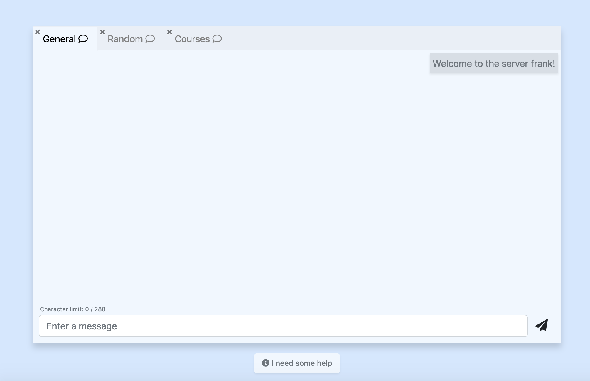

# Chat Server
An online chat server using socket.io.

## Project Description
This project is an online, real time chat application that allows users to connect and chat with each other. By default there are 3 different channels that users can talk in. Users also have the option to leave and join the individual channels.

### Front End
The front end of the application is built using bootstrap.

### Back End
The back end of the application is built using Node.js + Express.js, with socket.io providing the web sockets to enable the chat. The npm module [winston](https://www.npmjs.com/package/winston) is also used on the back end to facilitate logging.

## Requirements
To run the chat server you will need `Node.js`. Node can be installed from the [official Node JS website](https://nodejs.org/en/). Once Node is installed navigate to the project folder and run `npm install --production`. This will install all project dependencies. Once all project dependencies are installed run `npm run app` to run the server.

The default port the project runs on is `3000`. If you wish to run the server on another port you can change the port number in the `index.js` file.

## Dev Requirements
To run the server in a development mode, first install the dev dependencies with `npm install --dev`. Then run the server with `npm run dev`.

